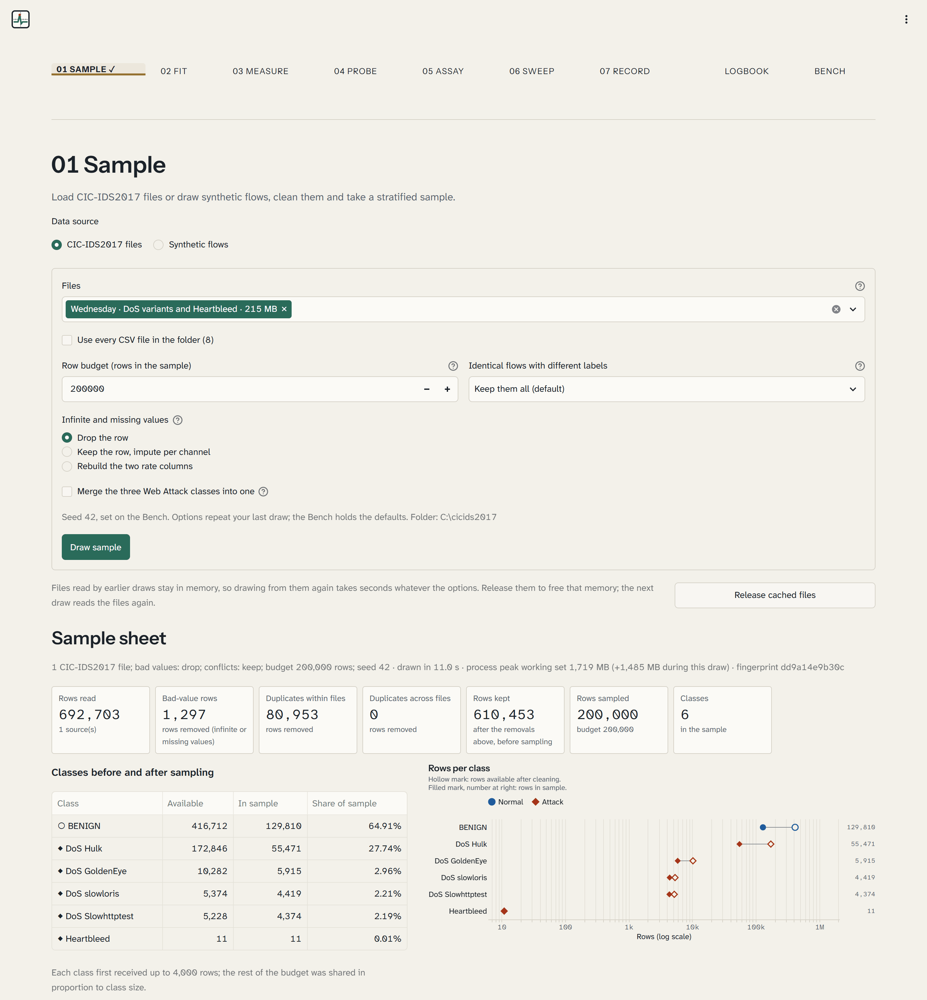
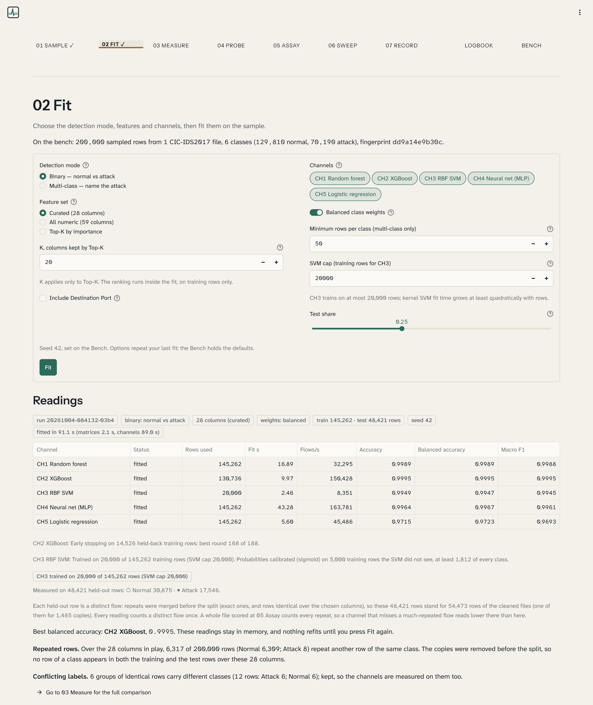
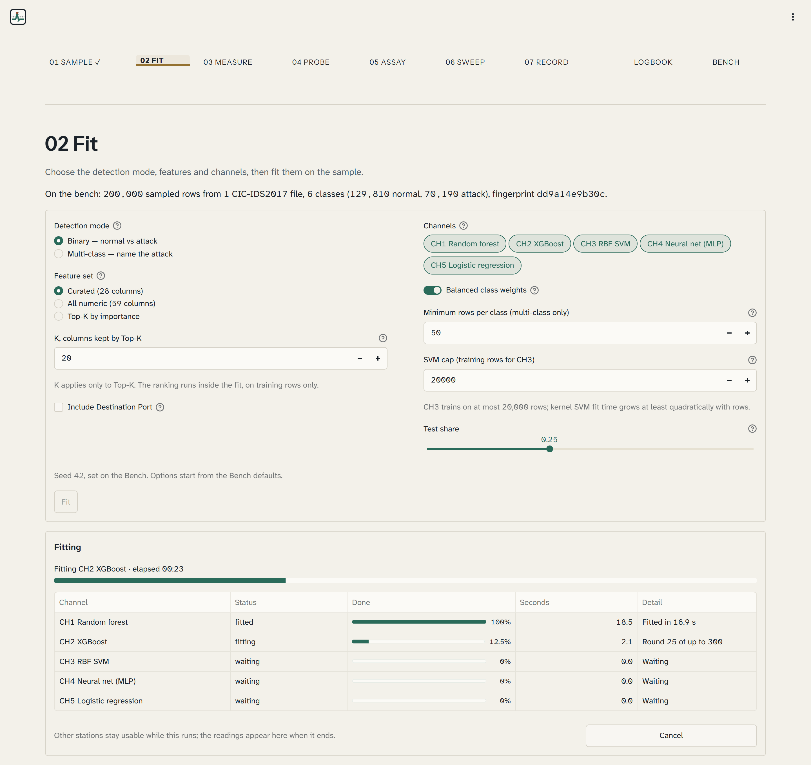
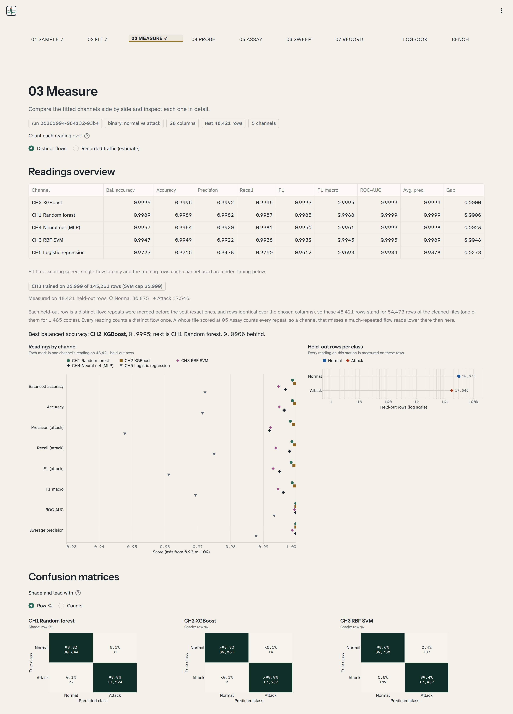
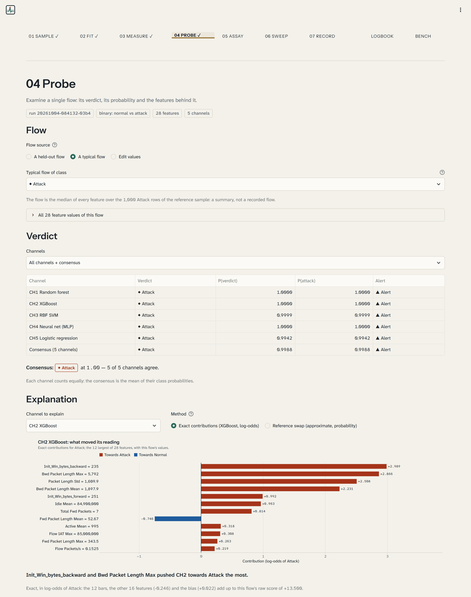
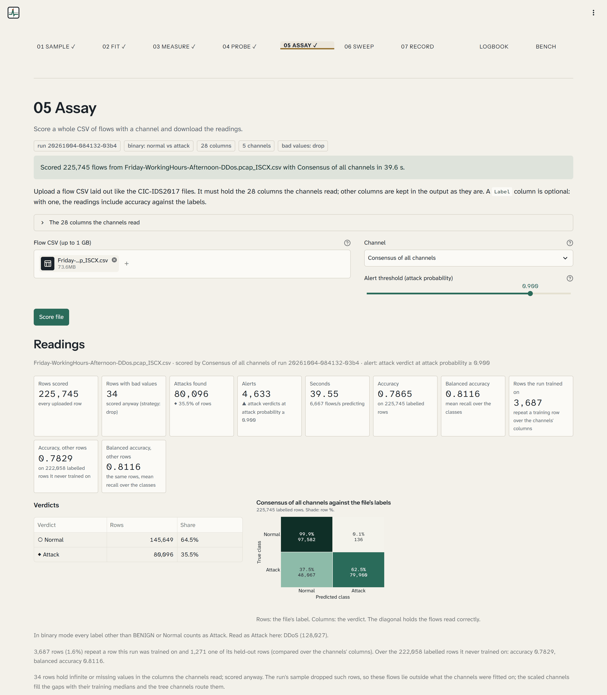
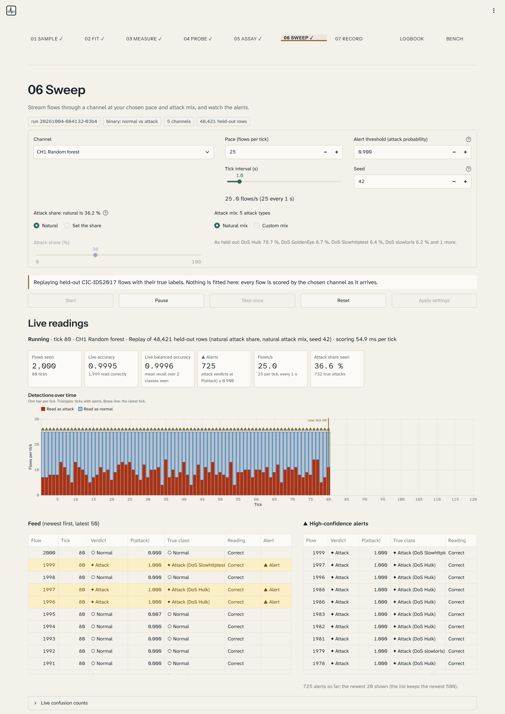
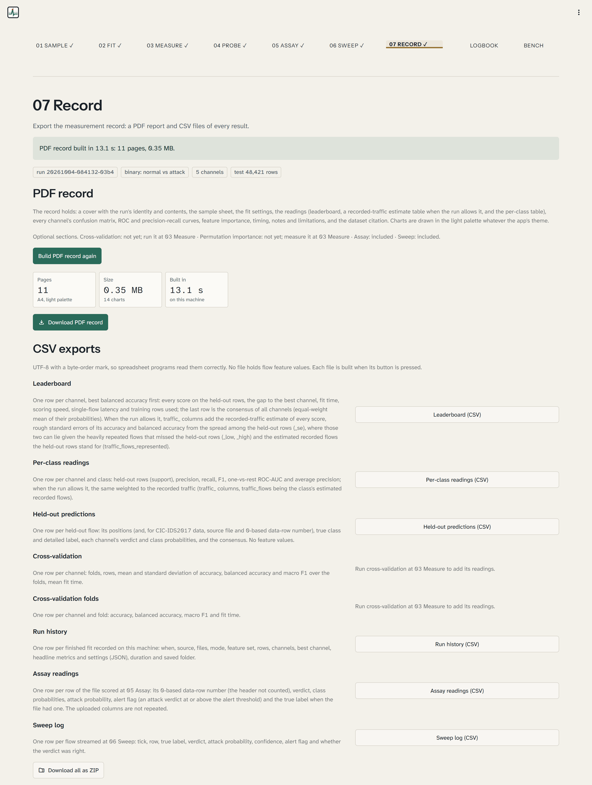
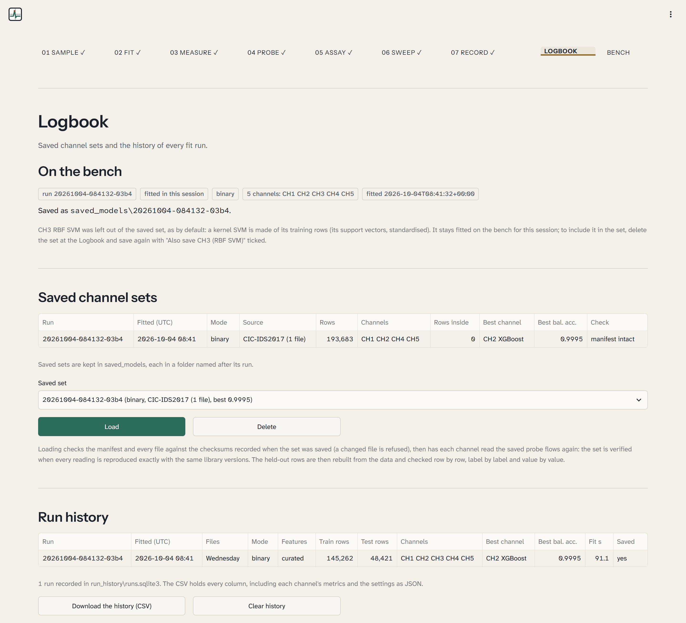

# Graticule

*A measuring bench for training, testing and comparing network-intrusion classifiers.*

Graticule is a local web app for studying machine-learning intrusion detection on labelled network-flow records. It
reads the CIC-IDS2017 flow files (or makes its own synthetic flows when they are absent), cleans and samples them,
and fits five classifiers on one shared, stratified split. Each model is a **channel** (CH1 to CH5) and each result
is a **reading**, always given with the rows it was taken on and with balanced accuracy beside accuracy. From a fit
you can compare the channels, explain a single verdict, replay held-out traffic as a live stream, score a whole CSV
file, keep verified copies of the fitted channels and export a PDF record.

A graticule is the ruled grid on an oscilloscope screen that every trace is read against; the app takes the same
attitude to its models. It runs on one machine, needs no network connection once installed, and never copies the
dataset into the project.

## Contents

[Stations](#stations) · [Features](#features) · [How the readings stay honest](#how-the-readings-stay-honest) ·
[Requirements](#requirements) · [Setup](#setup) · [Dataset](#dataset) · [Walkthrough](#walkthrough) ·
[Channels and metrics](#channels-and-metrics) · [Testing](#testing) · [Project structure](#project-structure) ·
[Limitations](#limitations) · [Licence and credits](#licence-and-credits)

## Stations

The app is a numbered procedure. A stepper across the top of every page shows the stations, marks the ones done in
this session with ✓, and lets you open any of them directly.

| Station | Purpose |
|---|---|
| **01 Sample** | Load the CSV files or generate synthetic flows; clean, de-duplicate and sample them |
| **02 Fit** | Choose the mode, feature set and channels, then fit them in the background |
| **03 Measure** | Compare the channels side by side and inspect each one in detail |
| **04 Probe** | Read one flow through every channel and see which features moved the verdict |
| **05 Assay** | Score an uploaded CSV file and download every row with its verdict |
| **06 Sweep** | Stream flows through a channel at a chosen pace and attack mix; watch the alerts |
| **07 Record** | Build the PDF record and download CSV exports |
| **Logbook** | Save, load (with verification) and delete channel sets; the history of every fit |
| **Bench** | Settings: data folder, cleaning strategy, row budget, SVM cap, seed, alert threshold and more |

## Features

### 01 Sample

- Two sources: the CIC-IDS2017 files in your data folder, or the built-in generator (a packet simulator feeding a flow
  meter that fills the same 77 columns; normal web, DNS, keep-alive and bulk traffic against five attack profiles).
- Three strategies for infinite and missing values: drop the row, keep it and impute per channel, or rebuild the two
  rate columns from the totals.
- A rare-aware sampler within a row budget, and the *sample sheet*: classes before and after sampling, a per-file
  table, and plain notes on file repairs, bad values, duplicates, conflicting labels and constant columns.

### 02 Fit

- Binary (normal vs attack) or multi-class (name the attack); curated (28 columns), all numeric, or Top-K features.
- Any subset of the five channels, capped balanced class weights (on by default), an SVM cap and a test share.
- Fitting runs in a background thread with per-channel progress, elapsed time and Cancel; the first readings appear
  as soon as it ends. A browser refresh does not lose a finished fit: 02 Fit offers to restore it.



### 03 Measure

- A leaderboard sorted by balanced accuracy with the gap to the best channel, a dot plot of every metric and the
  held-out class mix.
- *Count each reading over*: distinct flows (the default, every held-out row once) or the recorded traffic, an
  estimate that weights each held-out row by the recorded flows it stands for (see
  [Channels and metrics](#channels-and-metrics)).
- Confusion matrices for every channel (row % or counts), ROC and precision-recall curves, per-class tables,
  built-in importance and permutation importance on demand.
- Timing (a table and charts of fit seconds, flows per second, single-flow latency and rows used) and stratified
  cross-validation on demand, with a time estimate and Cancel.

### 04 Probe

- Take a held-out flow (filtered by true class or picked by row), a class-typical flow, or edit the values yourself.
- Every channel's verdict and probability, plus the **Consensus** (the mean of the channels' probabilities) with an
  agreement count such as "4 of 5 channels agree".
- Two explanations: exact XGBoost contributions in log-odds units, and an approximate *reference swap* for any channel.

### 05 Assay

- Upload a flow CSV (up to 1 GB) laid out like the CIC-IDS2017 files and score it with one channel or the Consensus.
- The download repeats every uploaded line with the verdict, class probabilities, attack probability and an alert
  flag appended. With a `Label` column you also get accuracy, balanced accuracy and a confusion matrix.
- Rows the run was trained on are recognised and counted, with readings over the other rows given separately, and
  an upload that is one of the run's own sample files is flagged. Binary runs list which labels they read as
  attacks; labels made only of digits are treated as unknown, not as attacks.

### 06 Sweep

- Replays **only held-out rows, with their true labels**, for real-data runs (a synthetic run may also stream fresh
  generated flows), at a pace you set, with an adjustable attack share and attack mix.
- Live accuracy and balanced accuracy, a timeline, a feed of the latest flows, live confusion counts and alerts
  (▲ Alert when an attack verdict reaches the alert threshold). Start, Pause, Step once, Reset.

### 07 Record

- A PDF built offline: sample sheet, fit settings, readings with a Consensus row, a recorded-traffic estimate table
  when the run allows it, per-class table, confusion matrices, curves, importance, timing, Assay and Sweep summaries
  when present, limitations and the citation.
- CSV exports one by one or as a ZIP: leaderboard, per-class readings, held-out predictions (no feature values),
  cross-validation, run history, Assay readings and the Sweep log.

### Logbook and Bench

- **Logbook:** save the current fit as a channel set, load one back with verification, delete one; browse and
  download the run history (one line per finished fit, kept in SQLite). CH3 is left out of a saved set unless you
  tick *Also save CH3 (RBF SVM)*, unticked for every new fit; the table of saved sets shows how many training rows
  each one holds (0, or CH3's support vectors).
- **Bench:** the data folder (with a found/missing check of the eight files) and the defaults every station starts
  from. Light (paper) and dark (graphite) themes, or the system setting, are chosen under *Theme* in the ⋮ menu at
  the top right.

## How the readings stay honest

- **Nothing is refitted by accident.** Options sit in forms, and work starts only from an explicit button (Draw
  sample, Fit, Score file, Build PDF record and the two on-demand measurements). Only Fit changes the channels;
  cross-validation fits temporary copies on training folds. A test changes every widget on every station after a fit
  and checks that nothing was fitted or prepared again.
- **Duplicates go before the split**: exact repeats within each file, then across files (the earliest file keeps its
  copy), then again over the chosen columns, because rows that differ only in a left-out column become identical.
  Every count is reported. Identical flows with different labels are kept and counted by default.
- **Stratified, seeded split.** Every class gets at least two training and two test rows. Everything learned from
  data (imputers, scalers, Top-K ranking, the SVM subset, calibration, early stopping) sees training rows only.
- **Rare classes are protected.** Each class first receives up to max(1,000, 2 % of the budget) rows before the rest
  of the budget is shared out, so all 11 Heartbleed flows survive a 200,000-row Wednesday sample. Classes under 10
  rows are left out and named; multi-class mode also applies a minimum class count (default 50).
- **Balanced weights, balanced accuracy.** Every channel trains with balanced sample weights, capped (100, or 50 for
  the MLP) and rescaled to sum to the row count. Balanced accuracy is shown beside accuracy everywhere and ranks the
  leaderboard. Scores carry four decimals, and a score short of 1 never prints as 1.0000 (anything from 0.9999 up
  to 1 shows as 0.9999).
- **The SVM cap is stated.** A kernel SVM's fit time grows at least quadratically with rows, so CH3 trains on a
  rare-aware draw of at most 20,000 rows (2,000 to 50,000 allowed) and says so: "CH3 trained on 20,000 of 145,262
  rows (SVM cap 20,000)".
- **float32 throughout.** Feature matrices are 32-bit floats, half the memory of the default.
- **Destination Port is opt-in.** In a lab capture a port can single out the attacked machines, so a model may learn
  the port instead of the behaviour. It is off by default and shown as a badge when on.
- **Verified reload.** A saved set records a SHA-256 for every file and refuses a changed one. On load each channel
  re-reads 512 saved probe flows and must reproduce its saved probabilities exactly; with other library versions
  the differences are listed and the set is marked *not verified*.
- **No dataset rows on disk unless you choose.** Saved sets hold the models, a manifest, *synthetic* probe flows and
  per-feature quantiles. Held-out rows are rebuilt from the data folder on load and checked against digests. For the
  same reason **CH3 is not saved by default**: a kernel SVM is made of its support vectors, which are training rows
  in scaled form, and the scaler saved beside them turns them straight back into dataset rows. Its readings stay in
  the manifest; refit it at 02 Fit when needed. Ticking *Also save CH3 (RBF SVM)* at the Logbook (off by default,
  never remembered between fits) writes `svm.joblib` with those rows into `saved_models\<run id>\` on your machine
  (git ignores the folder); the manifest declares how many it holds, and CH3 then loads back verified like the
  other channels.
- **Offline PDF.** Charts are drawn once with Altair, rendered to PNG by vl-convert and placed by fpdf2 with the
  bundled fonts. No browser and no network.
- **Never colour alone.** Normal is "○ Normal", attacks "◆ Attack" or "◆ class name", alerts "▲ Alert"; channels
  differ by dash pattern and marker as well as colour.

## Requirements

- Windows 11 with PowerShell (developed and tested there; Windows PowerShell 5.1 is enough).
- 64-bit Python 3.12 or newer, tested with 3.13. The floor is 3.12 because the pinned numpy 2.5.3 and xgboost 3.4.1
  require it.
- About 0.7 GB of disk for the virtual environment and 0.85 GB for the eight dataset files (kept wherever you like).
- Memory: measured on a 4-core laptop (Intel i5-8365U, 16 GB). Drawing a sample from all eight files peaks at about
  2.1 GB of working set; the 200,000-row Wednesday benchmark (sample plus five channels) at about 1.9 GB.

## Setup

From the project folder (the one that holds `app.py`), in PowerShell:

```powershell
py -3.13 -m venv .venv
.\.venv\Scripts\python.exe -m pip install -r requirements.txt
```

Then start the app. This is the only command you need from now on:

```powershell
.\.venv\Scripts\python.exe -m streamlit run app.py
```

- The install took about three minutes on the test laptop with the wheels already in pip's cache; a first download
  takes longer. `.\.venv\Scripts\python.exe -m pip check` should then answer "No broken requirements found."
- `py --list` shows the Python versions installed; with only 3.12, use `py -3.12 -m venv .venv`.
- Keep the project folder's path short, under about 90 characters (for example `C:\Users\<you>\Desktop\graticule`).
  Streamlit ships deeply nested files, and under Windows' default 260-character path limit pip stops with
  `[WinError 206] The filename or extension is too long` when the folder sits too deep.
- There is no need to activate the environment. Calling `.venv\Scripts\python.exe` directly always uses the right
  interpreter and avoids PowerShell's script-execution policy, which blocks `Activate.ps1` on many machines.
- `requirements.txt` pins the direct dependencies. To reproduce the tested environment package for package, install
  the full resolved set instead: `.\.venv\Scripts\python.exe -m pip install -r requirements-lock.txt`.

**First run.** Streamlit opens your default browser at <http://localhost:8501>; if it does not, open the address
printed in the terminal. The very first Streamlit run on a machine may ask for an email address in the terminal:
press Enter to skip it. The server listens on `localhost` only and usage statistics are switched off
(`.streamlit/config.toml`). If port 8501 is taken, Streamlit moves to the next free port and prints it; to choose one
yourself, add `--server.port 8765`. Stop the app with Ctrl+C in the terminal. With no data folder configured every
station works on synthetic flows, so you can try the whole procedure before downloading anything.

## Dataset

Graticule is built for **CIC-IDS2017** from the Canadian Institute for Cybersecurity (University of New Brunswick).

1. Request and download it from <https://www.unb.ca/cic/datasets/ids-2017.html>.
2. Take the **MachineLearningCSV** set and extract it anywhere outside this project. You need the folder that
   directly holds these eight files:

   | File | Session | Contents | Size |
   |---|---|---|---|
   | `Monday-WorkingHours.pcap_ISCX.csv` | Monday | normal traffic only | 169 MB |
   | `Tuesday-WorkingHours.pcap_ISCX.csv` | Tuesday | FTP and SSH password guessing | 129 MB |
   | `Wednesday-workingHours.pcap_ISCX.csv` | Wednesday | DoS variants and Heartbleed | 215 MB |
   | `Thursday-WorkingHours-Morning-WebAttacks.pcap_ISCX.csv` | Thursday morning | web attacks | 50 MB |
   | `Thursday-WorkingHours-Afternoon-Infilteration.pcap_ISCX.csv` | Thursday afternoon | infiltration | 79 MB |
   | `Friday-WorkingHours-Morning.pcap_ISCX.csv` | Friday morning | botnet | 56 MB |
   | `Friday-WorkingHours-Afternoon-PortScan.pcap_ISCX.csv` | Friday afternoon | port scan | 73 MB |
   | `Friday-WorkingHours-Afternoon-DDos.pcap_ISCX.csv` | Friday afternoon | DDoS | 74 MB |

3. Point Graticule at that folder, either at **Bench** → *Data folder* → *Save settings* (stored in the git-ignored
   `local_settings.json`), or with an environment variable set before starting the app:

   ```powershell
   $env:NIDS_DATA_DIR = "D:\datasets\CIC-IDS2017\MachineLearningCSV"
   .\.venv\Scripts\python.exe -m streamlit run app.py
   ```

   The Bench setting wins when both are present, and the Bench shows which of the eight files it found.

Only `*.csv` files directly inside the folder are read, and they are never copied, moved or rewritten. The reader
deals with the known quirks of these files: column names with leading spaces, the `Fwd Header Length` column that
appears twice (dropped by position after checking the copies agree), `Infinity` and empty cells in `Flow Bytes/s`
and `Flow Packets/s`, negative `-1` markers, Web Attack labels whose dash arrived as a replacement character
(`Web Attack � Brute Force` becomes `Web Attack - Brute Force`), and many exact duplicate rows (81,948 inside the
Wednesday file alone). See [data/README.md](data/README.md) for more.

Please cite the dataset authors when you use it:

> Iman Sharafaldin, Arash Habibi Lashkari, and Ali A. Ghorbani, "Toward Generating a New Intrusion
> Detection Dataset and Intrusion Traffic Characterization", 4th International Conference on
> Information Systems Security and Privacy (ICISSP), 2018.

## Walkthrough

1. **Bench.** Set the data folder and press *Save settings*. The other values are defaults the stations start from:
   bad-value strategy, row budget (200,000), minimum rows per class (50), Web Attack merge, SVM cap (20,000), test
   share (0.25), alert threshold (0.90) and seed (42).
2. **01 Sample.** Choose *CIC-IDS2017 files* or *Synthetic flows*, pick files (for a first look, Wednesday), keep or
   change the row budget and strategies, and press **Draw sample**. The sample sheet appears; files read once stay
   cached, so a second draw takes seconds (*Release cached files* frees the memory). For multi-class work you can
   merge the three Web Attack classes into one here. Monday on its own holds normal traffic only: the sheet notes
   "Only one class in this sample: every row is BENIGN", and at 02 Fit the Fit button answers "Nothing was fitted"
   with the same reason, starting no job, until a file with attacks is added.
3. **02 Fit.** Choose *Binary* or *Multi-class*, a feature set and the channels, and press **Fit**. Top-K keeps the K
   columns (5 to 40, default 20) a small XGBoost finds most useful on the training rows. In multi-class mode,
   classes below the minimum count are left out and listed (Wednesday's 11 Heartbleed flows, Thursday's 21 Sql
   Injection flows). Tick *Include Destination Port* only to see how much the port inflates the scores. A
   five-channel binary fit of a 200,000-row Wednesday sample takes about 40 s on the test laptop. Changing options
   afterwards fits nothing until you press Fit again.
4. **03 Measure.** Read the leaderboard, then the confusion matrices, curves and channel detail. *Measure
   permutation importance* and *Run cross-validation* are the only buttons here that start work; both can be
   cancelled, and neither changes the fitted channels.
5. **04 Probe.** Draw a held-out flow, pick a typical one or edit values; read the verdicts and the Consensus, then
   choose a channel and an explanation method.
6. **05 Assay.** Upload a CSV, choose a channel or the Consensus, press **Score file**, then *Download the scored CSV*.
7. **06 Sweep.** Choose a channel, pace and tick interval, attack share and mix, and press **Start**. Settings changed
   while it runs wait for *Apply settings*.
8. **07 Record.** Press **Build PDF record**, then *Download PDF record*; take the CSV files one by one or *Download
   all as ZIP* (the PDF, the CSV files and a `README.txt`). For a five-channel binary Wednesday run the record has 9
   pages with no optional section, 10 with cross-validation alone and 11 with Assay and Sweep (with or without
   cross-validation). It takes about 8 to 12 s to build on the test laptop on mains power (the first build after
   starting the app is the slower one) and 17 to 25 s on battery.
9. **Logbook.** Press **Save the current fit** to keep it under `saved_models\<run id>\`. CH3 stays out unless you
   first tick *Also save CH3 (RBF SVM)*, which also writes its support vectors (training rows) into that folder; the
   notice says which you chose. Later, even after a restart, pick the set and press **Load**: the files are checked,
   the channels re-read their probe flows, and the held-out rows are rebuilt from the data folder, after which every
   station works as before (without the data folder the stations say what they cannot show). *Delete* asks once
   more.

## Channels and metrics

Four model families, five channels. The reasoning behind each choice is in [DESIGN.md](DESIGN.md).

| Channel | Family | Configuration |
|---|---|---|
| CH1 Random forest | bagged trees | 150 trees grown 25 at a time, √features per split, min leaf 2, 50 % bootstrap |
| CH2 XGBoost | boosted trees | hist, depth 8, learning rate 0.15, up to 300 rounds, early stopping on a 10 % training slice |
| CH3 RBF SVM | kernel | C 10, gamma "scale", at most 20,000 training rows, sigmoid-calibrated on a separate slice |
| CH4 Neural net (MLP) | neural network | 128 → 64 units, adam, early stopping |
| CH5 Logistic regression | linear | lbfgs, C 1; the baseline that shows what the non-linear channels add |

CH3 to CH5 see a signed logarithm and standard scaling inside their pipelines, because flow features are very
long-tailed and some carry negative markers. Measured on the test laptop (Wednesday, 200,000-row budget, about
145,000 training and 48,000 test rows, curated features; wall-clock times vary from run to run):

| Channel | Binary fit (s) | Binary bal. acc. | Multi-class fit (s) | Multi-class bal. acc. |
|---|---|---|---|---|
| CH1 Random forest | 9.9 | 0.9989 | 7.6 | 0.9964 |
| CH2 XGBoost | 5.4 | 0.9995 | 8.2 | 0.9969 |
| CH3 RBF SVM (20,000-row cap) | 2.1 | 0.9947 | 2.4 | 0.9922 |
| CH4 Neural net (MLP) | 24.1 | 0.9967 | 43.3 | 0.9941 |
| CH5 Logistic regression | 3.0 | 0.9723 | 12.4 | 0.9751 |

The final check (2026-10-01, `scripts\bench.py`) reproduced every binary balanced accuracy above to four decimals,
with binary fit times of 8.6, 4.0, 1.1, 14.6 and 2.2 s for CH1 to CH5 and a peak working set of 1.9 GB.

These are held-out readings within one day's traffic, counting each distinct flow once (see
[Limitations](#limitations)). A Wednesday-fitted run scores the Thursday web-attack file at a balanced accuracy of
about 0.50: a model does not recognise attack types it has never seen.

**Recorded traffic (estimate).** 03 Measure can also count its leaderboard, dot plot, confusion matrices and
per-class table over the recorded traffic; the PDF adds a compact table, and the CSV exports and saved manifests add
`traffic_` columns. Each held-out row is weighted by `w = copies / f`: its copies in the cleaned files (the row
itself, its exact repeats and the rows identical to it over the chosen columns) divided by the share of its class
that 01 Sample kept. It is an estimate, never the default. Two counts are kept apart: on Wednesday (binary,
200,000-row budget, seed 42) the 48,421 held-out rows stand for 54,473 rows of the cleaned file and, once the classes
01 Sample thinned are scaled back up, for about 166,000 estimated recorded flows, an estimate of the held-out quarter
of the 691,406 flows in the cleaned file.

The estimate is only as good as the flows that land among the held-out rows. Wednesday repeats nine DoS Hulk flows
1,317 to 9,329 times each (16.5 % of its attack rows), and whether any of them is held out is chance; the standard
error sees only the held-out rows, so it cannot tell. 01 Sample therefore keeps how often the cleaned files recorded
every distinct flow, sampled or not. When the heavily repeated flows that missed the held-out rows could move a
reading by 0.01 or more, 03 Measure and the PDF say so and give each channel's **range**: its reading over the
recorded traffic if every one of those flows were misread, or read right. Seed 42 (one of the nine flows held out):

| Channel | Distinct acc. / bal. acc. | Traffic acc. ± s.e. (range) | Traffic bal. acc. ± s.e. (range) |
|---|---|---|---|
| CH1 Random forest | 0.9989 / 0.9989 | 0.9694 ± 0.027 (0.937 to 0.995) | 0.9561 ± 0.037 (0.914 to 0.994) |
| CH2 XGBoost | 0.9995 / 0.9995 | 0.9996 ± 0.0001 (0.942 to 0.9997) | 0.9997 ± 0.0001 (0.920 to 0.9997) |
| CH3 RBF SVM | 0.9949 / 0.9947 | 0.9477 ± 0.027 (0.916 to 0.974) | 0.9260 ± 0.035 (0.887 to 0.966) |
| CH4 Neural net (MLP) | 0.9964 / 0.9967 | 0.9654 ± 0.027 (0.933 to 0.991) | 0.9518 ± 0.037 (0.910 to 0.990) |
| CH5 Logistic regression | 0.9715 / 0.9723 | 0.9193 ± 0.027 (0.889 to 0.947) | 0.9001 ± 0.035 (0.862 to 0.941) |

Over every row of the cleaned file CH1 reads 0.9403 accuracy (0.9184 balanced), inside its range, and 05 Assay over
the 509,414 rows the run never trained on reads it at 0.9303 and CH2 at 0.9996. CH1's misreads come almost entirely
(40,308 of 42,247 rows) from eight of the nine heavily repeated flows. With other seeds (for the sample and the
split) the held-out rows caught none or two of them, and CH1's estimate moved between 0.805 and 0.998 with standard
errors as small as 0.0002, while its range held the file's reading every time (binary seeds 2, 4, 5 and 42,
multi-class seed 42).

**Metrics:** accuracy, balanced accuracy, precision, recall and F1 (binary: the attack class; multi-class: macro and
weighted, plus a per-class table), ROC-AUC (one-vs-rest macro for multi-class), average precision, confusion
matrices, ROC and precision-recall curves, built-in and permutation importance, cross-validation spread, fit time,
throughput (flows per second) and single-flow latency (ms). The held-out class counts are shown next to the scores.

## Testing

```powershell
.\.venv\Scripts\python.exe -m pytest -q
```

At the last check (2026-10-04) the suite held 642 tests. The default run takes the 605 not marked `slow`: 222 s on
the test laptop on battery, against 251 s for the same tests with the previous, larger test profile measured just
before it (about 2 minutes on mains power, last measured before these changes). `-m realdata` selects 35 tests,
`-m slow` 37 (the two overlap; together they are 47 tests and took about 10 minutes on battery), and the markers
`unit`, `integration` and `ui` 393, 125 and 107. The default run includes the restart checks: a saved set reloaded
in a second Python process predicts identically, and the run history reads back from a new process. Tests never
touch your settings, saved sets or history (each works in its own temporary folder) and write no dataset rows
anywhere. Real-data tests find the files through
`"--data-dir=<folder>"` (write it as one quoted token with `=`; a separate path argument confuses pytest's search
for its settings), else `NIDS_DATA_DIR`, else the Bench setting, and skip when there is no folder. The ten quick
ones (headers, labels and the file catalogue) run in the default suite; the heavy ones only when asked for:

| Command | What runs |
|---|---|
| `.\.venv\Scripts\python.exe -m pytest -q` | everything except tests marked `slow` (about 2 min on mains power, 3.5 to 4 min on battery) |
| `.\.venv\Scripts\python.exe -m pytest -q -m realdata` | every real-data test: whole files, label counts, full-size fits, stations on a real run, benchmarks (about 4.5 min on mains power, 8 min on battery) |
| `.\.venv\Scripts\python.exe -m pytest -q -m slow -s` | the long tests: benchmarks, fresh-process checks of 03 Measure on loaded sets, full PDF builds, heavy real-data runs (about 4 min on mains power, 10 min on battery; `-s` prints the benchmark tables) |
| `.\.venv\Scripts\python.exe -m pytest -q -m ui` | headless Streamlit checks of every station (`-m unit` and `-m integration` select the same way) |

The timing benchmark can also be run directly. It reads the app's data folder (or `--data-dir`; synthetic flows when
there is none), prints rows used, fit seconds, flows per second, accuracy and balanced accuracy per channel, then the
peak working set, and writes nothing. The first line below takes about 40 s:

```powershell
.\.venv\Scripts\python.exe scripts\bench.py --files Wednesday-workingHours.pcap_ISCX.csv --rows 200000 --mode binary
.\.venv\Scripts\python.exe scripts\bench.py --help
```

## Project structure

```text
graticule/
├── app.py                    entry point: hands over to the shell in ui/shell.py
├── graticule/                core library: data and machine learning, never imports Streamlit
│   ├── __init__.py           package version
│   ├── data/                 reader, cleaning, sampling, synthetic flows, sample preparation
│   ├── models/               channel registry, training, background jobs, transforms, consensus
│   ├── report/               PDF record (pdf.py) and CSV exports (exports.py)
│   ├── evaluate.py           metrics, curves, importance, cross-validation, timing
│   ├── explain.py            single-flow verdicts and explanations (04 Probe)
│   ├── features.py           feature sets: curated, all numeric, Top-K, port opt-in
│   ├── history.py            run history in SQLite
│   ├── persist.py            save, verify, load and delete channel sets
│   ├── schema.py             column names, label clean-up, the eight expected files
│   ├── scoring.py            batch scoring (05 Assay)
│   ├── settings.py           Bench settings and data-folder resolution
│   ├── simulate.py           the stream engine (06 Sweep)
│   ├── theme.py              every colour, glyph and font name in one place
│   └── viz.py                Altair chart builders shared by the screen and the PDF
├── ui/                       Streamlit interface
│   ├── pages/                one module per station, each with render()
│   ├── shell.py              navigation, stepper and page dispatch
│   ├── stations.py           the station list: numbers, titles, purposes
│   ├── state.py              session state and the process-wide run registry
│   ├── training_ui.py        Fit progress panel and readings
│   ├── data_cache.py         per-file caching for 01 Sample
│   └── components.py         stepper, badges, reading cards, CSS
├── scripts/bench.py          command-line timing benchmark
├── tests/                    unit/, integration/, ui/, realdata/, slow/, conftest.py, helpers.py
├── static/                   graticule-icon.svg and fonts/ (three variable TTFs with their OFL licences)
├── .streamlit/config.toml    themes, fonts, upload limit, localhost-only server, no usage statistics
├── data/README.md            where to get the dataset (no data is kept here)
├── docs/screenshots/         the README images and how they were captured
├── saved_models/             saved channel sets (git-ignored, created as you save)
├── run_history/              runs.sqlite3 (git-ignored)
├── README.md                 this guide
├── DESIGN.md                 design decisions and measurements, phase by phase
├── LICENSE                   MIT licence
├── .gitignore                keeps data, saved sets, history and local settings out of git
├── .gitattributes            LF line endings for text; fonts, images and PDFs marked binary
├── pyproject.toml            project metadata and pytest configuration
├── requirements.txt          direct dependency pins
└── requirements-lock.txt     the full resolved environment
```

`local_settings.json` appears in the project folder after the first *Save settings* at the Bench; git ignores it.

## Limitations

- **One laboratory dataset.** CIC-IDS2017 was captured on one test network over five working days in 2017. Readings
  describe that dataset, not a deployment; other networks and later traffic differ in mix and behaviour.
- **Flow records only.** Graticule reads CICFlowMeter-style CSV files. It does not capture packets or convert pcap
  files; producing flow records from your own traffic needs CICFlowMeter or a compatible tool.
- **Distinct flows, not traffic volume.** Exact repeats are merged before the split, as they must be, so every
  reading counts each distinct flow once. The files repeat some flows thousands of times (one DoS Hulk flow appears
  9,329 times in Wednesday), so a whole file can read differently from the held-out rows: on Wednesday, CH1 reads
  0.9989 balanced accuracy on its held-out rows but 0.9390 accuracy (0.9168 balanced) over the whole file at
  05 Assay, because it misses some of those heavily repeated flows, while CH2 XGBoost reads the whole file at 0.9996.
  02 Fit, 03 Measure and the PDF state how many rows of the cleaned files the held-out rows stand for. 03 Measure's
  recorded-traffic view estimates the effect by weighting each held-out row with the recorded flows it stands for (see
  [Channels and metrics](#channels-and-metrics)). It is a sample estimate whose standard error sees only the held-out
  rows: when heavily repeated flows miss them it can look precise and still be far off, so the station warns and gives
  the range those flows leave open (CH1 on Wednesday: 0.9694 ± 0.027, range 0.937 to 0.995; 0.9403 over the 691,406
  rows of the cleaned file, 0.9303 at 05 Assay over the rows it never trained on).
- **One held-out split per run.** Another seed or sample moves the numbers; cross-validation at 03 Measure shows how
  much. Near-identical (not exact) flows can still sit on both sides of the split, and labelling errors in the source
  pass straight into the readings.
- **Calibration only on CH3.** Other channels report their models' own probabilities, so an alert threshold is not a
  guaranteed error rate.
- **The kernel SVM is capped and not saved by default.** CH3 sees at most 50,000 training rows and must be refitted
  after a load, unless it was saved by choice, in which case its saved set holds those support vectors (training
  rows) on disk.
- **Saved models are pickles.** `.joblib` files run code when loaded; checksums catch damage, not deliberate forgery.
  Load only sets made on your machine or by someone you trust.
- **Single machine, single user.** A Streamlit app with one fit (or measurement) at a time per process, meant for
  `localhost`, not for exposure on a network.
- **Explanations are local.** Reference swap is an approximation for one flow; exact contributions exist for CH2 only.

## Licence and credits

Graticule is released under the MIT licence, © 2026 mohsin-moallim; see [LICENSE](LICENSE).

The fonts in `static/fonts/` (Instrument Sans, Atkinson Hyperlegible Next and Atkinson Hyperlegible Mono) are
distributed under the SIL Open Font License 1.1; their licence texts sit beside them as `OFL-*.txt`.

The CIC-IDS2017 dataset is the work of the Canadian Institute for Cybersecurity, University of New Brunswick:
Iman Sharafaldin, Arash Habibi Lashkari, and Ali A. Ghorbani, "Toward Generating a New Intrusion Detection Dataset and
Intrusion Traffic Characterization", 4th International Conference on Information Systems Security and Privacy
(ICISSP), 2018.

Built on Streamlit, pandas, NumPy, PyArrow, scikit-learn, XGBoost, Altair, vl-convert and fpdf2.

Dataset: CIC-IDS2017, Canadian Institute for Cybersecurity, University of New Brunswick.

> Iman Sharafaldin, Arash Habibi Lashkari, and Ali A. Ghorbani, "Toward Generating a New Intrusion
> Detection Dataset and Intrusion Traffic Characterization", 4th International Conference on
> Information Systems Security and Privacy (ICISSP), 2018.
